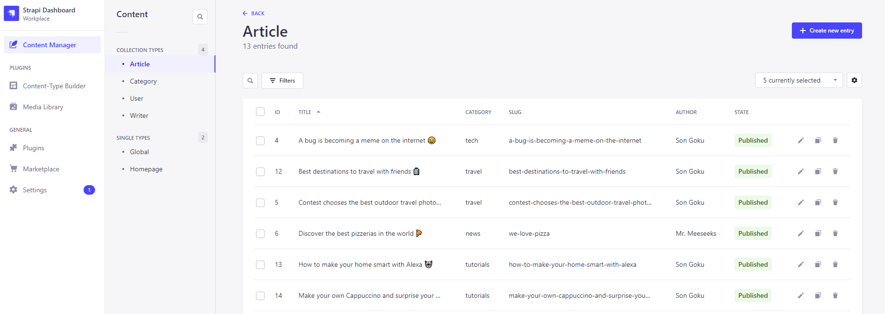

# Starter - Strapi CMS

Template base para criação de um CMS utilizando Strapi com `Cloudinary` e `PostgreSQL`.



<br />

## Cloudinary

As configurações do Provider do Cloudinary estão no arquivo `./config/plugins.js` e os dados sensíveis devem ser passados via variáveis de ambiente, como mostrado no `.env.example`

```js
module.exports = ({ env }) => {
  if (env("NODE_ENV") === "production") {
    return {
      upload: {
        config: {
          provider: "cloudinary",
          providerOptions: {
            cloud_name: env("CLOUDINARY_NAME"),
            api_key: env("CLOUDINARY_KEY"),
            api_secret: env("CLOUDINARY_SECRET"),
          },
        },
      },
    };
  }

  return;
};
```

Para que as thumbnails possam ser vistas no painel devemos alterar as configurações de segurança no arquivo `./config/middlewares.js` e incluir o domínio do GCS

```js
module.exports = [
  "strapi::errors",
  "strapi::security",
  {
    name: "strapi::security",
    config: {
      contentSecurityPolicy: {
        useDefaults: true,
        directives: {
          "connect-src": ["'self'", "https:"],
          "img-src": ["'self'", "data:", "blob:", "res.cloudinary.com"],
          "media-src": ["'self'", "data:", "blob:", "res.cloudinary.com"],
          upgradeInsecureRequests: null,
        },
      },
    },
  },
  "strapi::cors",
  "strapi::poweredBy",
  "strapi::logger",
  "strapi::query",
  "strapi::body",
  "strapi::favicon",
  "strapi::public",
];
```

## Database

Esse starter está configurado com `PostgreSQL` para configuração em ambiente de Produção e `SQLite` para o ambiente de desenvolvimento local.\
Quando em ambiente local os dados ficam armazenados na pasta `.tmp` na raiz do projeto.

Para os detalhes de conexão do banco de produção, definir as informações nas variáveis de ambiente como demonstrado no `.env.example`

```js
const path = require("path");

module.exports = ({ env }) => {
  if (env("NODE_ENV") === "production") {
    return {
      connection: {
        client: "postgres",
        connection: {
          host: env("DATABASE_HOST", "127.0.0.1"),
          port: env.int("DATABASE_PORT", 5432),
          database: env("DATABASE_NAME", "strapi"),
          user: env("DATABASE_USERNAME", "root"),
          password: env("DATABASE_PASSWORD", "root"),
          ssl: {
            rejectUnauthorized: env.bool("DATABASE_SSL", false), // For self-signed certificates
          },
        },
      },
    };
  }

  return {
    connection: {
      client: "sqlite",
      connection: {
        filename: path.join(
          __dirname,
          "../",
          env("DATABASE_FILENAME", ".tmp/data.db")
        ),
      },
      useNullAsDefault: true,
    },
  };
};
```

## Inserção de dados na instalação do Strapi

O Strapi permite que utilizemos uma função para gerar conteúdo de marcação (dummy content) que pode ser aproveitada para subirmos uma nova LP com seus dados de forma automática.

Para isso devemos utilizar a função `bootstrap` do Strapi definida nos arquivos `./src/index.js` e `.src/bootstrap.js` como no exemplo abaixo que cria automaticamente os artigos, categorias e autores desse stater e preenche também os dados de SEO com um conteúdo padrão para uso nas `aplicações Frontend`

`./src/index.js`

```js
"use strict";

const boostrap = require("./bootstrap");

module.exports = {
  async bootstrap() {
    await boostrap();
  },
};
```

`./src/bootstrap.js`

```js
"use strict";

const fs = require("fs");
const mime = require("mime-types");
const set = require("lodash.set");
const { categories, writers, articles, global } = require("../data/data.json");

const isFirstRun = async () => {
  const pluginStore = strapi.store({
    environment: strapi.config.environment,
    type: "type",
    name: "setup",
  });
  const initHasRun = await pluginStore.get({ key: "initHasRun" });
  await pluginStore.set({ key: "initHasRun", value: true });
  return !initHasRun;
};

const setPublicPermissions = async (newPermissions) => {
  // Find the ID of the public role
  const publicRole = await strapi
    .query("plugin::users-permissions.role")
    .findOne({
      where: {
        type: "public",
      },
    });

  // Create the new permissions and link them to the public role
  const allPermissionsToCreate = [];
  Object.keys(newPermissions).map((controller) => {
    const actions = newPermissions[controller];
    const permissionsToCreate = actions.map((action) => {
      return strapi.query("plugin::users-permissions.permission").create({
        data: {
          action: `api::${controller}.${controller}.${action}`,
          role: publicRole.id,
        },
      });
    });
    allPermissionsToCreate.push(...permissionsToCreate);
  });
  await Promise.all(allPermissionsToCreate);
};

const getFileSizeInBytes = (filePath) => {
  const stats = fs.statSync(filePath);
  const fileSizeInBytes = stats["size"];
  return fileSizeInBytes;
};

const getFileData = (fileName) => {
  const filePath = `./data/uploads/${fileName}`;

  // Parse the file metadata
  const size = getFileSizeInBytes(filePath);
  const ext = fileName.split(".").pop();
  const mimeType = mime.lookup(ext);

  return {
    path: filePath,
    name: fileName,
    size,
    type: mimeType,
  };
};

// Create an entry and attach files if there are any
const createEntry = async ({ model, entry, files }) => {
  try {
    if (files) {
      for (const [key, file] of Object.entries(files)) {
        // Get file name without the extension
        const [fileName] = file.name.split(".");
        // Upload each individual file
        const uploadedFile = await strapi
          .plugin("upload")
          .service("upload")
          .upload({
            files: file,
            data: {
              fileInfo: {
                alternativeText: fileName,
                caption: fileName,
                name: fileName,
              },
            },
          });

        // Attach each file to its entry
        set(entry, key, uploadedFile[0].id);
      }
    }

    // Actually create the entry in Strapi
    const createdEntry = await strapi.entityService.create(
      `api::${model}.${model}`,
      {
        data: entry,
      }
    );
  } catch (e) {
    console.log("model", entry, e);
  }
};

// Create first user admin
const createAdminUser = async () => {
  if (process.env.ADMIN_CREATE === "false") {
    console.log(
      `CREATE_ADMIN option is defined as ${process.env.ADMIN_CREATE} in env config. Skiping user creation`
    );
    return;
  }

  // Check if admin user exists
  const hasAdmin = await strapi.service("admin::user").exists();
  if (hasAdmin) {
    return;
  }

  // Check is super admin role exists
  let superAdminRole = await strapi.service("admin::role").getSuperAdmin();
  if (!superAdminRole) {
    try {
      console.log("Role does not exists, creating role");
      await strapi.service("admin::role").create({
        name: "Super Admin",
        code: "strapi-super-admin",
        description:
          "Super Admins can access and manage all features and settings.",
      });
    } catch (error) {
      console.log("Could not create admin role...");
      console.error(error);
    }

    superAdminRole = await strapi.service("admin::role").getSuperAdmin();
    if (!superAdminRole) {
      console.log("can't create the role. Skiping user creation...");
      return;
    }
  }

  try {
    // Create admin account
    console.log("Setting up admin user...");
    await strapi.service("admin::user").create({
      username: process.env.ADMIN_USERNAME,
      email: process.env.ADMIN_EMAIL,
      firstname: process.env.ADMIN_FN,
      lastname: process.env.ADMIN_LN,
      password: process.env.ADMIN_PASS,
      isActive: true,
      blocked: false,
      registrationToken: null,
      roles: superAdminRole ? [superAdminRole.id] : [],
    });
    console.info("Admin Account created...");
  } catch (error) {
    console.log("Could not create admin user...");
    console.error(error);
  }
};

async function importCategories() {
  return Promise.all(
    categories.map((category) => {
      return createEntry({ model: "category", entry: category });
    })
  );
}

async function importWriters() {
  return Promise.all(
    writers.map(async (writer) => {
      const files = {
        picture: getFileData(`${writer.email}.jpg`),
      };
      return createEntry({
        model: "writer",
        entry: writer,
        files,
      });
    })
  );
}

async function importArticles() {
  return Promise.all(
    articles.map((article) => {
      const files = {
        image: getFileData(`${article.slug}.jpg`),
      };

      return createEntry({
        model: "article",
        entry: {
          ...article,
          // Make sure it's not a draft
          publishedAt: Date.now(),
        },
        files,
      });
    })
  );
}

// Create Globals SEO data
const importGlobal = async () => {
  const files = {
    favicon: getFileData("favicon.png"),
    "defaultSeo.shareImage": getFileData("default-image.png"),
  };
  return createEntry({ model: "global", entry: global, files });
};

// Call Import data functions
const importSeedData = async () => {
  // Allow read of application content types
  await setPublicPermissions({
    global: ["find"],
    article: ["find", "findOne"],
    category: ["find", "findOne"],
    writer: ["find", "findOne"],
  });

  console.log("Bootstraping data...");
  // Create all entries
  await importCategories();
  await importWriters();
  await importArticles();
  await importGlobal();
};

// Run bootstrap functions
module.exports = async () => {
  // Check if is first run and if BOOTSTRAP_CONTENT env var is true
  const bootstrapContent = process.env.BOOTSTRAP_CONTENT;
  const shouldImportSeedData = await isFirstRun();

  if (shouldImportSeedData) {
    console.log("First install, let's check if we have to create some data...");
    await createAdminUser();

    if (bootstrapContent === "true") {
      try {
        console.log("Setting up the template...");
        await importSeedData();
        console.log("Ready to go!");
      } catch (error) {
        console.log("Could not import seed data...");
        console.error(error);
      }
    }
  }
};
```

Nesse exemplo de código estamos utilizando os dados contidos no JSON `data.json` dentro da pasta `./data`.\
As imagens importadas dessa forma estão inseridas dentro da pasta `./data/uploads` e serão tratadas no código.

Nesse código de exemplo as imagens precisam ser nomeadas com o mesmo slug definido no JSON.\
Pra gerar conteúdo na primeira instalação será necessário passar a variável `BOOTSTRAP_CONTENT` com o valor `true` no seu arquivo `.env`.\
Ex: `BOOTSTRAP_CONTENT=true`

Também adicionei ao bootstrap a função `createAdminUser()` que criará o primeiro usuário de ADMIN durante a instalação do STRAPI.\
Os dados do usuário padrão devem ser passados nas variáveis de ambiente. Caso opte por não criar o ADMIN de forma automática, basta passar false na variável `ADMIN_CREATE=false`

`NOTA:`

```
Essa função de bootstrap só irá ser executada na primeira instalação do painel.
Então não precisamos nos preocupar com sobrescrita dos dados.
```

## Changelog

### 1.0.0

- Criação da estrutura base do strapi na versão `4.1.0`
- Inclusão do modelo das variáveis de ambiente do projeto no `.env.example`
- Criação dos Content-Types `Articles`, `Categories`, `Writers` e `Globals`/`SEO` que irá gerar os METADADOS de SEO para uso nas aplicações frontend
- Inserção automática do conteúdo de `POSTS`, `CATEGORIAS`, `GLOBALS/SEO` e geração do `ADMIN USER` utilizando a função `bootstrap()` do Strapi no arquivo `./src/bootstrap.js`

<br/>

---

<br/>

### 🚀 Sobre o Strapi

O Strapi vem com uma [Interface de linha de comando](https://docs.strapi.io/developer-docs/latest/developer-resources/cli/CLI.html) (CLI) completa, que permite que você gerencie seu projeto em segundos.

#### `develop`

Inicie seu aplicativo Strapi com o **autoReload** ativado. [Saiba mais](https://docs.strapi.io/developer-docs/latest/developer-resources/cli/CLI.html#strapi-develop)

```
npm run develop
# or
yarn develop
```

#### `start`

Inicie seu aplicativo Strapi com o **autoReload** desativado. [Saiba mais](https://docs.strapi.io/developer-docs/latest/developer-resources/cli/CLI.html#strapi-start)

```
npm run start
# or
yarn start
```

#### `build`

Construa seu painel de administração. [Saiba mais](https://docs.strapi.io/developer-docs/latest/developer-resources/cli/CLI.html#strapi-build)

```
npm run build
# or
yarn build
```

### ⚙️ Deploy

O Strapi oferece muitas opções de implantação possíveis para o seu projeto. Encontre aquele que combina com você na [seção de implantação da documentação](https://docs.strapi.io/developer-docs/latest/setup-deployment-guides/deployment.html).

### 📚 Documentação

- [Centro de recursos](https://strapi.io/resource-center) - Centro de recursos do Strapi.
- [Documentação do Strapi](https://docs.strapi.io) - Documentação oficial da Strapi.
- [Tutoriais Strapi](https://strapi.io/tutorials) - Lista de tutoriais feitos pela equipe principal e pela comunidade.
- [Blog do Strapi](https://docs.strapi.io) - Blog oficial do Strapi contendo artigos feitos pela equipe Strapi e pela comunidade.
- [Changelog](https://strapi.io/changelog) - Saiba mais sobre as atualizações do produto Strapi, novos recursos e melhorias gerais.

Sinta-se à vontade para conferir o [repositório Strapi GitHub](https://github.com/strapi/strapi). Seus comentários e contribuições são bem-vindos!

### ✨ Comunidade

- [Discord](https://discord.strapi.io) - Venha conversar com a comunidade Strapi, incluindo a equipe principal.
- [Fórum](https://forum.strapi.io/) - Lugar para discutir, fazer perguntas e encontrar respostas, mostrar seu projeto Strapi e obter feedback ou apenas conversar com outros membros da Comunidade.
- [Awesome Strapi](https://github.com/strapi/awesome-strapi) - Uma lista com curadoria de coisas incríveis relacionadas ao Strapi.
